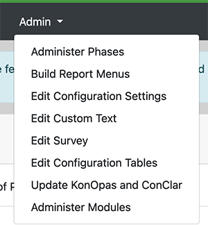
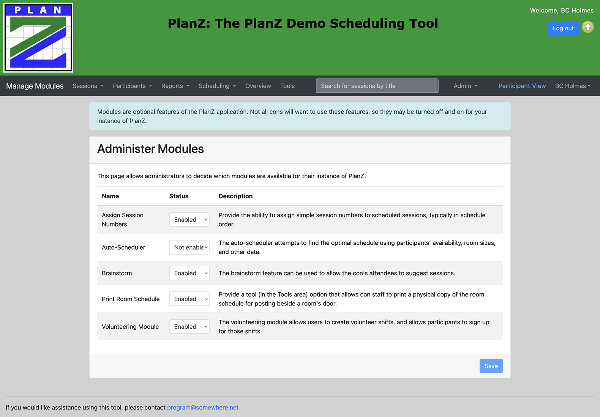

# Modules

Modules are optional parts of PlanZ that can be turned on or off according to the needs of
a particular con.

The ultimate end-goal of modules is to support a "plug-in functionality" system, comparable
to how WordPress plugins work. While the module system has not yet reached that lofty goal,
we can accomplish a certain amount of customization of the installation using modules, and
that's useful.

## Working with Modules

Modules can be enabled or unenabled using the "Administer Modules" screen, available from the
Admin menu. Only folks with Admin privileges can access it.

The following screen shows the list of modules, and allows the administrator to change the enabled
status of the module.

## Modules versus Phases

The ability to enable and unenable modules is very similar to the ability to enable and unenable
phases, but the two concepts are fairly distinct.

1. Modules refer to functions that a con either uses or doesn't use.
2. Phases refer to functions that a con uses, but might enable at different times during the con
   (e.g. the Brainstorm phase might be open in the early part of the con planning process, but
   closed as we get closer to the con.)

## Capabilities available to Modules

At the moment, modules can be used to:

1. make available certain permission roles
   - Because menu items can be linked to permissions, we can essentially suppress or show certain
     menu items based on whether or not a module is enabled.
2. make available certain reports
3. make available certain tools

### Third Party Modules

The ability to provide third-party tools is currently limited, but at least one con has implemented
third party modules (particularly for tools).

## Descriptor

To help support modules, we've introduced a notion of a "Module Descriptor". The module descriptor
is a class -- identified by a particular naming standard -- that provides information about what
additional functionality can be provided by a module.

An example of the module descriptor is the `webpages/module/planz/room_schedule_module.php`. The name
of this descriptor is derived from its "package name" (which is in the database): `planz.room_schedule`.

This module descriptor has a static function `getTools()` that the module system interrogates to
determine what tools the module contributes to the PlanZ application.
