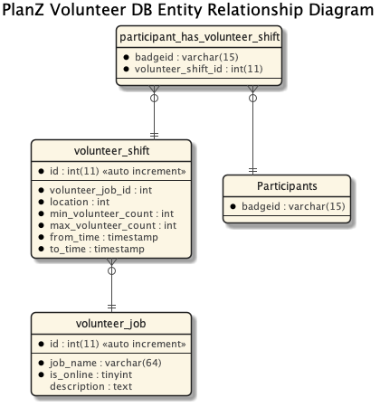

# Volunteering Functionality

The volunteering functionality has two key components:

1. A tool that allows a Volunteer Coordinator to set up volunteer jobs and shifts; and
2. A tool that allows con members to sign up for shifts.

## User Interface

Both portions of the volunteering functionality use React as the front-end. More details about the react app can be
found in the [README file for the React client code](../../../client/README.md).

## Database and Tables

The following diagram shows the tables that were created specifically to support volunteering functionality.

