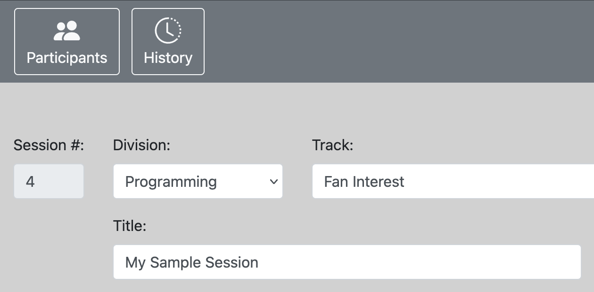
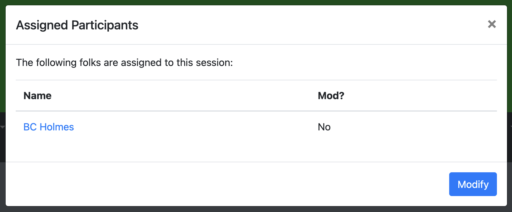
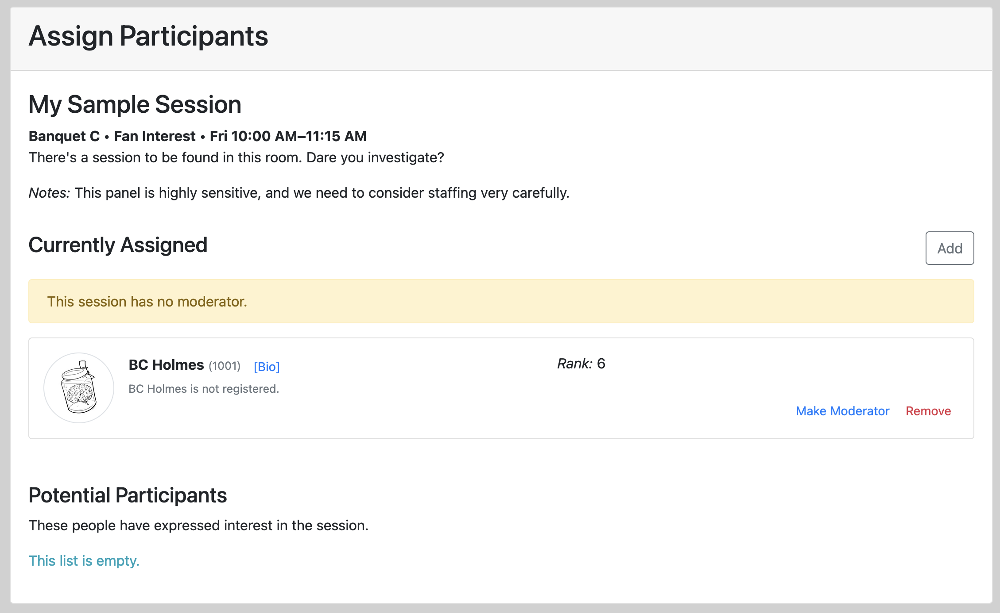
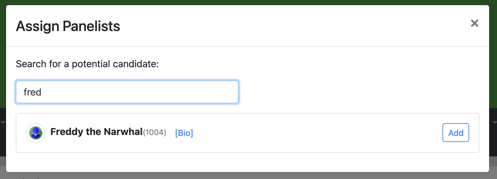

# Assigning Participants to a Session

To assign a participant to a session, first look up the session. In the toolbar at the top, there should be a button that says "Participants".

Selecting that button should show a modal dialog with a list of the current participants.

To modify the assignments, select the "Modify" button, and you should be presented with the

The screen should show the most up-to-date information about the session (including, for example,
if it has already been scheduled in a room/time slot). Additionally, notes about the session are visible.

If participants have expressed interest in the session already, then their information should appear at the bottom of the page.

You can look up other participants using the "Add" button, and search on their details.

## Moderators

Many sessions should have a moderator. There's a button that allows you to make one of the participants a moderator. Moderators should be specified with the term "(Mod)" after their name and a different border style.

## Notes

You can edit the notes for a panel by hovering over the notes until the pencil icon appears. When it appears, click it to get into an edit mode for the notes.