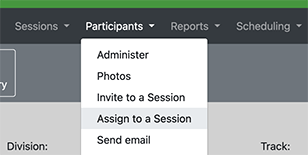

# Creating, Assigning and Scheduling Sessions

If your con is like most cons, eventually you're going to want to schedule things: programming panels, readings, special 
events, costuming competitions, and whatnot. And you may be asking yourself, how do I do this? Hopefully this guide 
can get you started.

## Before You Start

There are a couple of things that you need to have set up before you begin:

1. Your PlanZ administrator needs to set up some data that describes the various rooms that you'll be scheduling stuff in. 
   If they're competent, they've probably already done this.
2. Your PlanZ administrator needs to give you access to the Staff View pages because all the scheduling features are 
   there and you can't use them if you don't have access. If you're logged in to the site, and you can't see the 
   "Staff View" item in the nav bar, then you probably don't have access:   
   

## What are Sessions?

Different types of things that the con might schedule -- panels, readings, events, etc. -- are referred to as "sessions".

## Creating Sessions

Depending on how your con runs, there are two ways that sessions get created:

1. Some cons solicit session suggestions from their usual membership communities. PlanZ supports this process
   using a "brainstorm" feature. PlanZ users can access the brainstorm part of the application, and submit a
   suggestioned session. In most cons, there is a "Brainstorm" phase -- a schedule around when the con is 
   open for suggestions. You usually want to close the brainstorming phase well before the con: it's probably
   not useful to have folks suggesting new session ideas the day before the con.
   - Sometimes, cons have a brainstorming process, but they manage it outside of PlanZ. Maybe your ConCom 
     really loves Google forms or something. That's totally fine, but in that case you'll want to get those
     suggestions into PlanZ for subsequent parts of the scheduling process. To do that, you'll want to enter 
     those suggestions manually, as we discuss in point 2, below.
2. The other approach is that Programming comes up with a list of sessions and manually enters them in to
   PlanZ using the "Create New Session" feature:  
   

When you create a session manually, you'll need to provide a few important pieces of data:

1. Division : Most Programming Committees divvy up responsibility for the schedule to different people:
   some people work with Events, some people work with the Academic track, and others work with Gaming. 
   These different responsible areas are called "Divisions". You probably have a good idea what 
   division you're working with, and if you don't see it in the drop down, contact the PlanZ admin.
2. Track : tracks help give members an idea of the broad themes of the sessions. Tracks might include
   "TV and Movies" or "Fantasy" or "LGBTQ+ Themes". 
3. Room Set : How should the room be laid out? Is it in "panel" format, with a table at the front
   and rows of chairs pointed at the table? Or do you need one big work table, with lots of chairs
   around it for games or small workshops? Eventually, someone is going to have to give instructions
   to the hotel about how to set up the room. You'll probably also want to think about room sets 
   in later parts of the scheduling process. It'll probably be logistically impossible to reconfigure
   rooms too many times, so it's better to put sessions in to a room that's already set up the right
   way, than to expect too many reconfigurations.
4. Duration : at most cons, most sessions use a default duration (for most cons, this is either 
   1 hour and 15 minutes, or 50 minutes). You con's default should already be provided, but if 
   you're not sticking with the default, then you should change it. For example, movie showings might
   need to be longer, based on the length of the movie. Or an awards ceremony might take several hours.
5. Status : When you're ready to started assigning participants, the session must be in the "Vetted",
   "Assigned" or "Scheduled" status. (This is true of the default way to set up Plan Z; admins 
   can create other statuses, but that probably introduces a lot of complexities)

There are other data fields, but most of them should be self-evident.

## Assigning Participants to a Session

When you're ready to assign Participants to a session, you should use the "Assign to a Session" nav item.  

(Full disclosure: this page is kinda awful-looking. We hope to fix that in a later release).

How do you know who should be assigned to a session? There are probably three approaches:

1. Maybe you know a lot of people who are coming to the con, and already have a good idea who would be 
   a good participant on a session. You can manually add them.
2. Maybe you've asked your members to sign up using a Google form or some such mechanism. As in (1), 
   above, you can manually add them.
3. PlanZ includes two tools to allow people to express interest:
   - The Session Feedback/Interest Survey allows users to see the list of all relevent sessions, and asks people
     to indicate if they want to be on a particular session.
   - The "Search Sessions" tool is an alternative way for people to indicate their interest in a session.

If users have used either of the tools in option (3), then they should appear on the "Assign Participants"
screen. 

Some cons like to ask participants to confirm their session assignments. PlanZ has a feature that allows that.
Other cons would rather handle that informally: assuming that potential participants will email if there's a 
problem.

In any event, participants cannot see their assignments until the PlanZ admin turns on the "My Schedule"
option.

## Scheduling Sessions

At some point, you'll want to schedule sessions. Often, you'll schedule a session after you've assigned 
participants, but it's not fully necessary. 

PlanZ includes two tools that you can use for scheduling:

1. The "Maintain Room Schedule" tool; and
2. The "Grid Scheduler".

Both of these tools can be found in the "Scheduling" nav drop-down.

Each tool has some limitations and advantages.

### Maintain Room Schedule

The "Maintain Room Schedule" tool works with a single room at a time. First you can select the room,
and then you can add sessions to the room's schedule.

The limitation of the Maintain Room Schedule tool is that it requires a number of fussy steps to get a 
session scheduled. But it's quite flexible in terms of allowing you to schedule any event at any time.

### Grid Scheduler

The "Grid Scheduler" tool assumes that all sessions fit neatly into a grid. And that's probably its
biggest limitation, because it's not always true.

But on the plus side, you can work with multiple rooms at a time, and assign sessions a bit more 
easily to the grid. 

## Review Your Work

Under the "Scheduling" nav bar drop-down, there's a "Current Schedule" nav item. You can use this 
option to review what sessions are currently scheduled in what rooms. 

## Additional Consideration

Potential participants have probably given some indications that:

1. They have time periods where they might be available to be on sessions; and
2. They might have other preferences about being on sessions (like, "Please don't schedule me on a session 
   with Joe; we have a really complicated history.")

PlanZ does not (and in many cases cannot) enforce these constraints. But there are various conflict reports
that are probably worth reviewing.