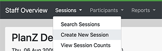
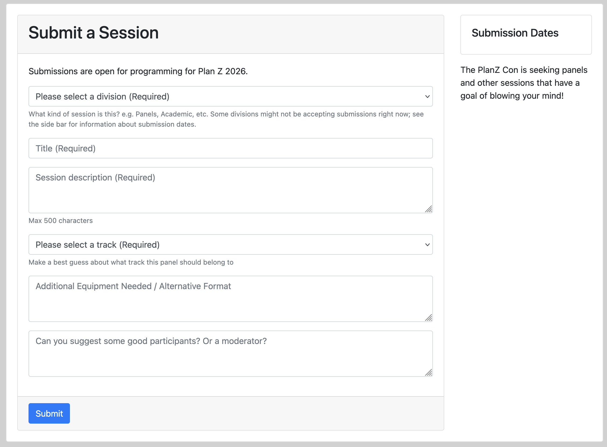
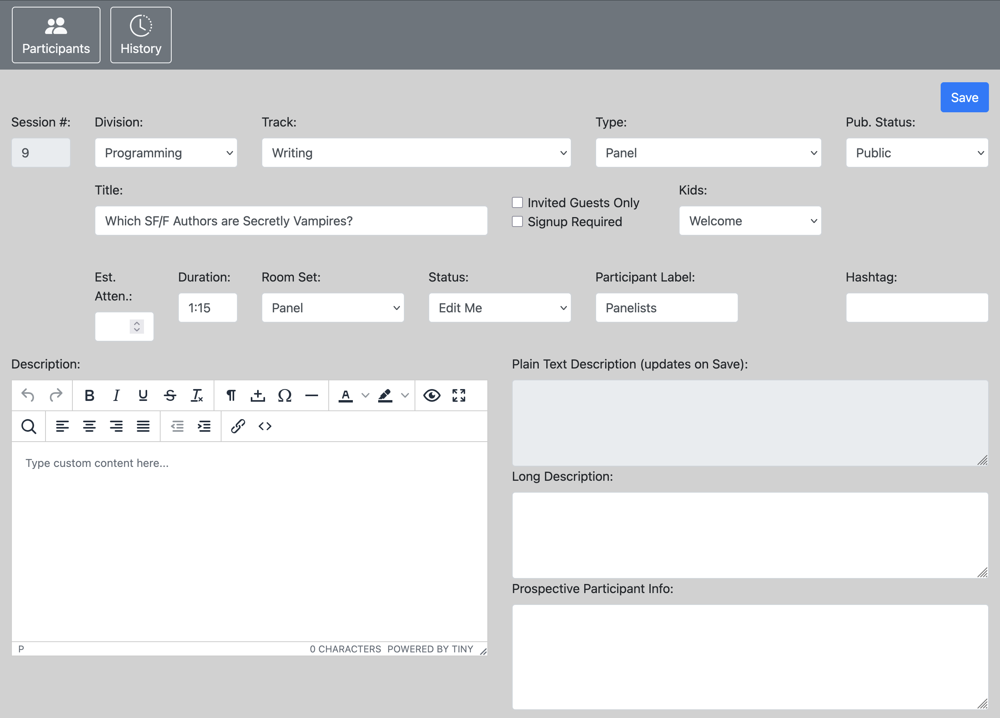

# Creating Sessions

Depending on how your con runs, there are two ways that sessions get created:

1. Some cons solicit session suggestions from their usual membership communities. PlanZ
   supports this process using a "brainstorm" feature. PlanZ users can access the brainstorm
   part of the application, and submit a suggestioned session. In most cons, there is a "Brainstorm"
   phase -- a schedule around when the con is open for suggestions. You usually want to close the brainstorming phase well before the con: it's probably not useful to have folks suggesting new
   session ideas the day before the con.
   - Sometimes, cons have a brainstorming process, but they manage it outside of PlanZ. Maybe your
     ConCom really loves Google forms or something. That's totally fine, but in that case you'll
     want to get those suggestions into PlanZ for subsequent parts of the scheduling process. To
     do that, you'll want to enter those suggestions manually, as we discuss below.
2. The other approach is that Programming comes up with a list of sessions and manually
   enters them in to PlanZ using the "Create New Session" feature:
   

## Before You Start

There are a couple of things that you need to have set up before you begin:

1. Your PlanZ administrator needs to set up some data that describes the various rooms that you'll be scheduling stuff in.
   If they're competent, they've probably already done this.
2. Your PlanZ administrator needs to give you access to the Staff View pages because all the scheduling features are
   there and you can't use them if you don't have access. If you're logged in to the site, and you can't see the
   "Staff View" item in the nav bar, then you probably don't have access:
   

## What are Sessions?

Different types of things that the con might schedule -- panels, readings, events, etc. -- are referred to as "sessions".

## Brainstorming

PlanZ's brainstorming feature is implemented as an optional "module" that your site's administrator needs to activate. Talk to them about turning that on.

When brainstorming module is turned on and the brainstorming phase is enabled, participants should see an additional menu item like so:

The brainstorming screen looks like this:

This screen allows users to submit session ideas. More details about brainstorming [can be found over here](./using_the_brainstorm_function.md).

## Creating a Session Manually

When you create a session manually, you'll need to provide a few important pieces of data:

1. Division : Most Programming Committees divvy up responsibility for the schedule to different people:
   some people work with Events, some people work with the Academic track, and others work with Gaming.
   These different responsible areas are called "Divisions". You probably have a good idea what
   division you're working with, and if you don't see it in the drop down, contact the PlanZ admin.
2. Track : tracks help give members an idea of the broad themes of the sessions. Tracks might include
   "TV and Movies" or "Fantasy" or "LGBTQ+ Themes".
3. Room Set : How should the room be laid out? Is it in "panel" format, with a table at the front
   and rows of chairs pointed at the table? Or do you need one big work table, with lots of chairs
   around it for games or small workshops? Eventually, someone is going to have to give instructions
   to the hotel about how to set up the room. You'll probably also want to think about room sets
   in later parts of the scheduling process. It'll probably be logistically impossible to reconfigure
   rooms too many times, so it's better to put sessions in to a room that's already set up the right
   way, than to expect too many reconfigurations.
4. Duration : at most cons, most sessions use a default duration (for most cons, this is either
   1 hour and 15 minutes, or 50 minutes). Your con's default should already be provided, but if
   you're not sticking with the default, then you should change it. For example, movie showings might
   need to be longer, based on the length of the movie. Or an awards ceremony might take several hours.
5. Status : When you're ready to started assigning participants, the session must be in the "Vetted",
   "Assigned" or "Scheduled" status. (This is true of the default way to set up Plan Z; admins
   can create other statuses, but that probably introduces a lot of complexities)

There are other data fields, but most of them should be self-evident.

