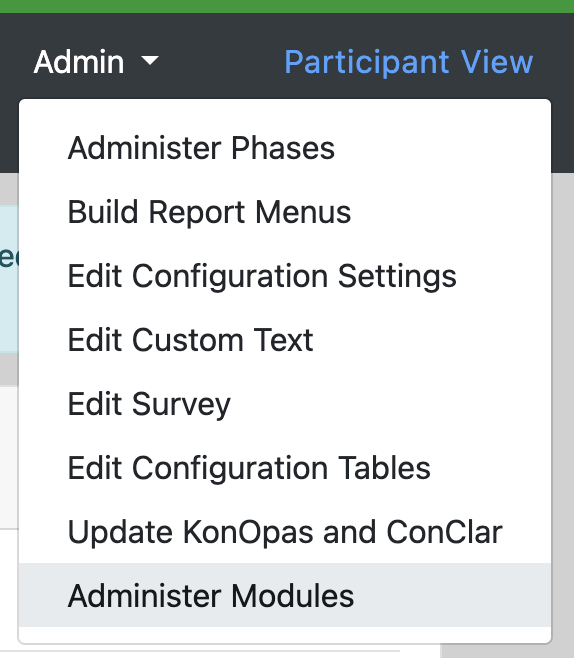
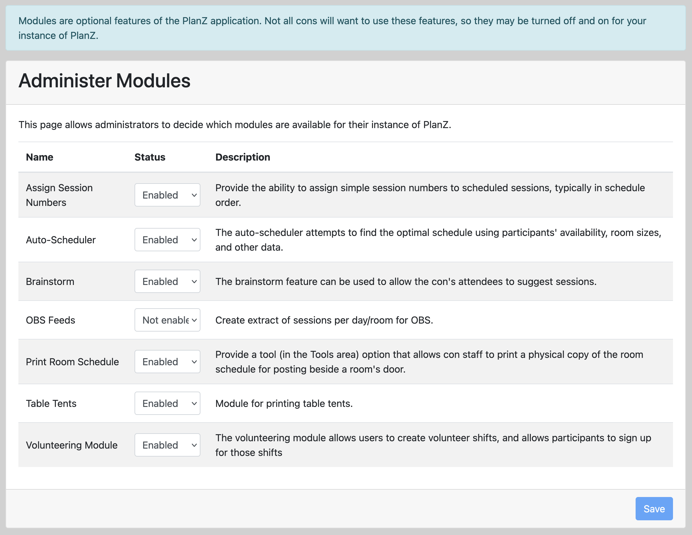

# Optional Modules

PlanZ includes a number of optional modules that add additional capabilities to the PlanZ webapp.

Here are some of the available modules:

| Module Name | Capability |
| ----------- | ---------- |
| Assign Session Numbers | Provide the ability to assign simple session numbers to scheduled sessions, typically in schedule order. |
| Auto-Scheduler | The auto-scheduler attempts to find the optimal schedule using participants' availability, room sizes, and other data. |
| [Brainstorm](./using_the_brainstorm_function.md) | The brainstorm feature can be used to allow the con's attendees to suggest sessions.
| OBS Feeds | Create extract of sessions per day/room for OBS. |
| Print Room Schedule | Provide a tool (in the Tools area) option that allows con staff to print a physical copy of the room schedule for posting beside a room's door. |
| Table Tents | Module for printing table tents. |
| [Volunteering Module](./volunteer_module.md) | The volunteering module allows users to create volunteer shifts, and allows participants to sign up for those shifts |

## Working with Modules

To access the optional modules, site admins can use the "Administer Modules" option in the Admin menu.

The nav item shows the following screen that provides the ability to enable or unenable individual modules. You might not immediately see the changes related to a module.

