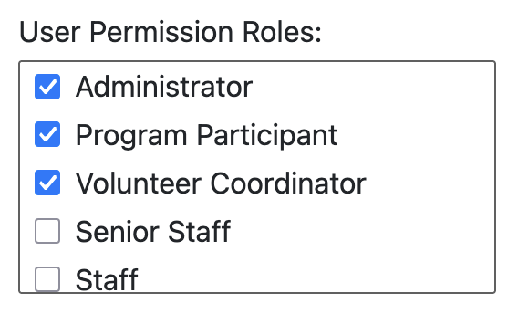
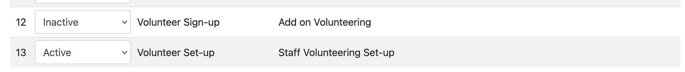
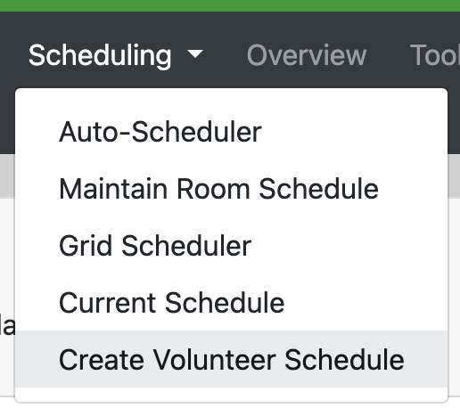
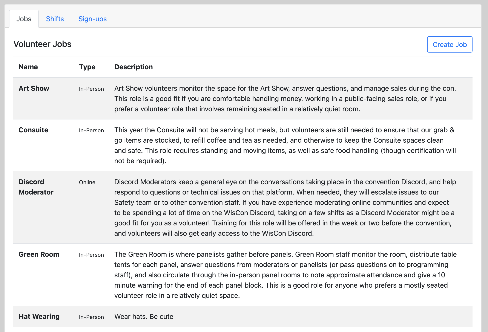
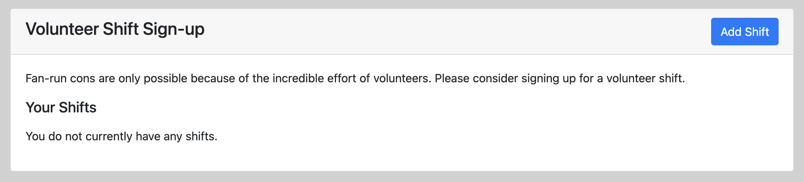
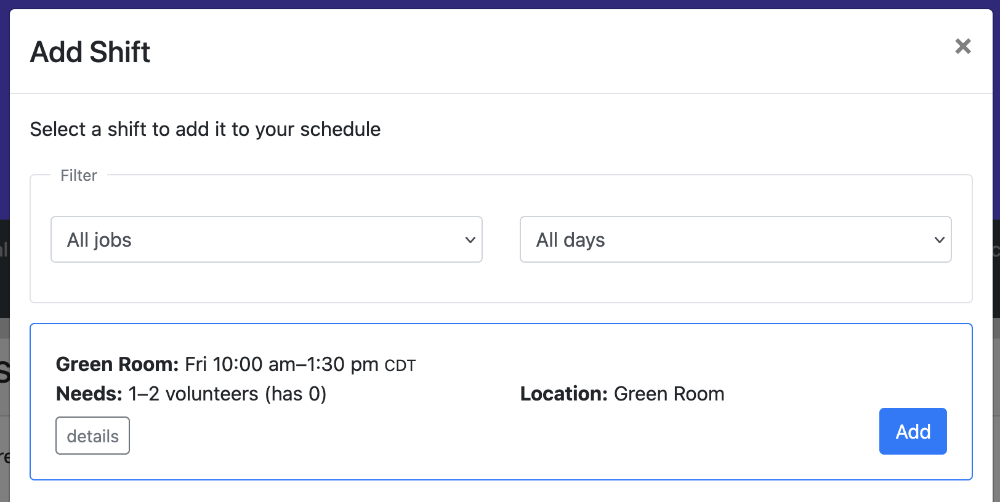

# Volunteer Module

The volunteer module allows a con to use PlanZ to set-up a volunteer jobs and schedules and allows participants to sign up for volunteer positions.

There are a few parts things that this module adds.

First, it creates a permission role called "Volunteer Coordinator" that gives people the power to create a modify Volunteer jobs and shifts.

Second, it creates two new phases in the app: one for opening up a period to define jobs and shifts, and one for allowing participants to sign up for shifts.

When the "Volunteer Set-up" phase is active, there should be an option under "Scheduling" to set up jobs and shifts (but only for users who have the "Volunteer Coordinator" role).

And that menu option should take you to the volunteer set-up screen:

## Participant Volunteer Shift Sign-Up

Lastly, when the "Volunteer Sign-up" Phase is active, participants can select the "Volunteer" menu option to see the sign-up page:

And using the "Add" button, they can select shifts that they want to add to their schedules.

