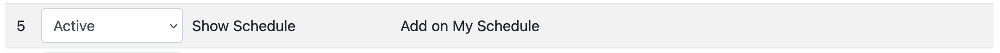
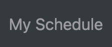
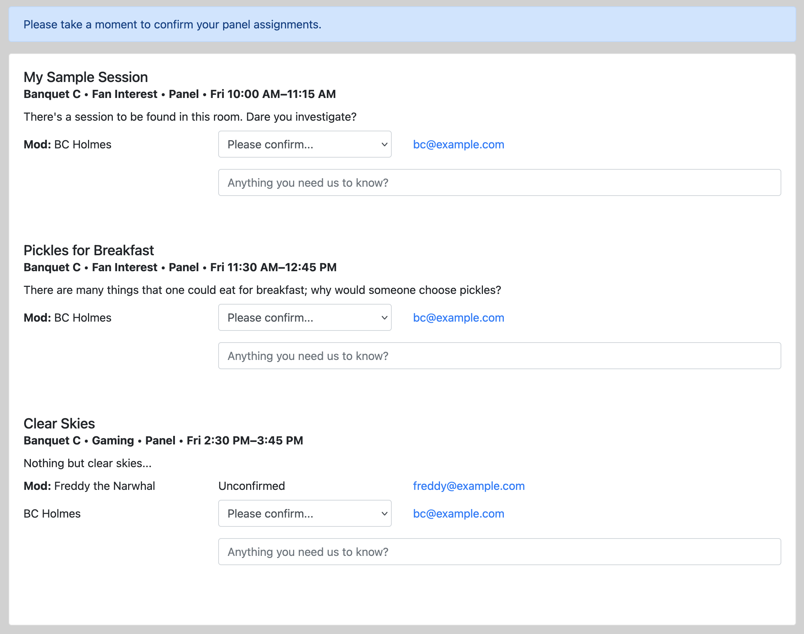

# Notification and Acceptance

Different cons handle notification and acceptance differently, so there are no hard-and-fast rules about how to manage these tasks. But PlanZ provides some tools to help support these processes.

## Acceptance

PlanZ provides a "My Schedule" screen that allows participants to review their initial session assignments and confirm that they'll participate.

The "My Schedule" screen is turned on when the appropriate Phase is activated:

When this Phase is active, an extra menu option is available to Participants:

And users can review their sessions and let the con know if they are no longer able to take part.

The Programming Team can keep track of the assignments and confirmation status using the "Participant Assignments with Confirmation Status" report.

