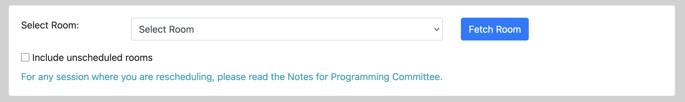
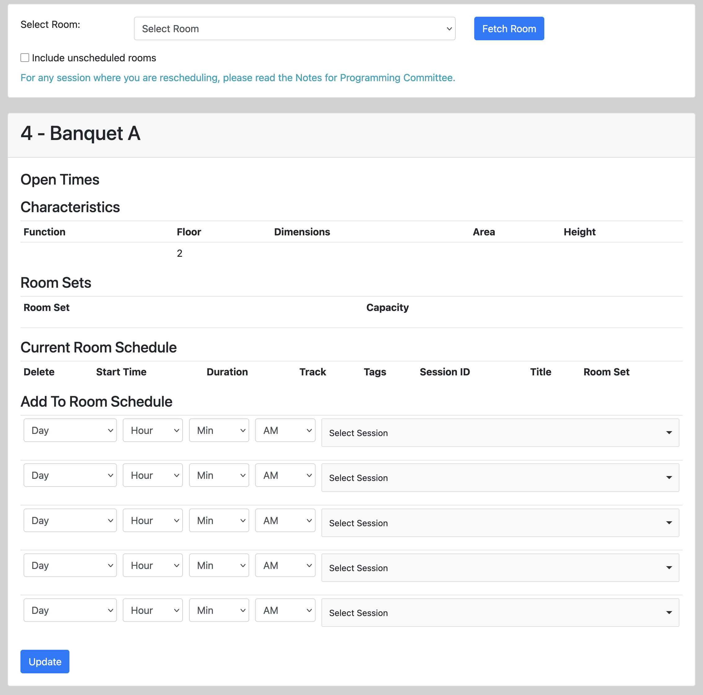
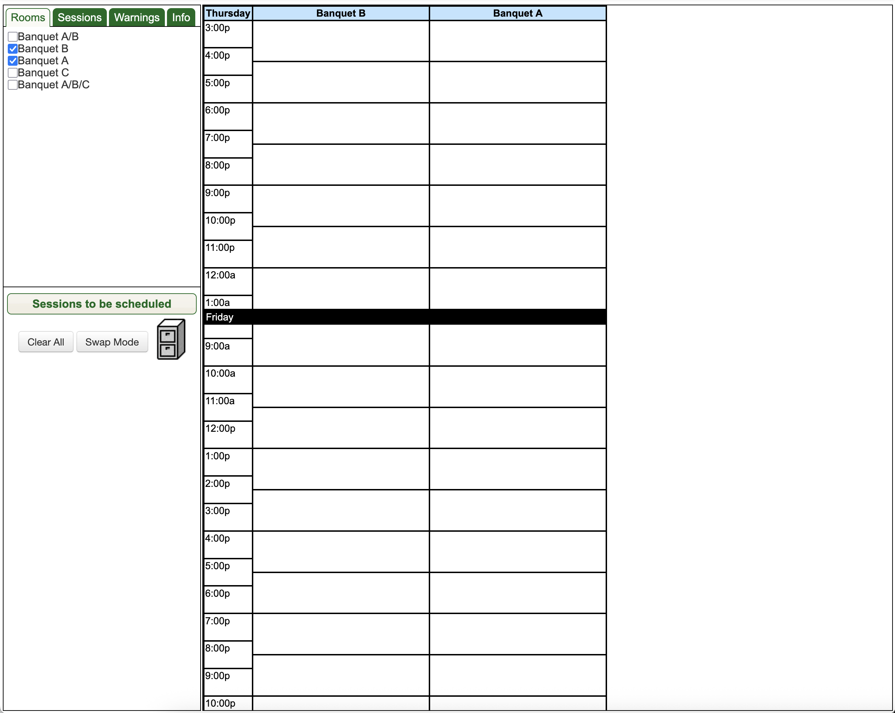
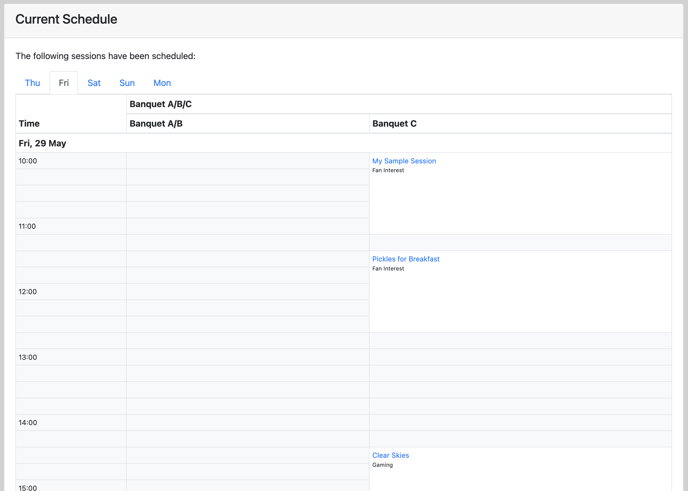

# Scheduling Sessions

At some point, you'll want to schedule sessions. Often, you'll schedule a session after you've assigned
participants, but it's not fully necessary.

PlanZ includes two features that you can use for scheduling:

1. The "Maintain Room Schedule" tool; and
2. The "Grid Scheduler".

Both of these features can be found in the "Scheduling" nav drop-down.

Each tool has some limitations and advantages.

## Maintain Room Schedule

The "Maintain Room Schedule" feature works with a single room at a time. First you can select the room,
and then you can add sessions to the room's schedule.

The limitation of the Maintain Room Schedule feature is that it requires a number of fussy
steps to get a session scheduled. But it's quite flexible in terms of allowing you to
schedule any event at any time.

To use the "Maintain Room Schedule" feature, first select a room to work with.

And once a room is selected, you can add or remove items from the schedule as appropriate.

## Grid Scheduler

The "Grid Scheduler" feature assumes that all sessions fit neatly into a grid. And that's probably its
biggest limitation, because it's not always true.

But on the plus side, you can work with multiple rooms at a time, and assign sessions a bit more
easily to the grid.

To use the Grid Scheduler, first select which rooms you want to work with.

Then, you can look up the sessions you want to schedule.

Then, finally, you can drag and drop the sessions onto the appropriate cell in the room grid.

# Review Your Work

Under the "Scheduling" nav bar drop-down, there's a "Current Schedule" nav item. You can use this
option to review what sessions are currently scheduled in what rooms.

# Additional Consideration

Potential participants have probably given some indications that:

1. They have time periods where they might be available to be on sessions; and
2. They might have other preferences about being on sessions (like, "Please don't schedule me on a session with Joe; we have a really complicated history.")

PlanZ does not (and in many cases cannot) enforce these constraints. But there are various conflict reports that are probably worth reviewing.